# Bai-tap-ca-nhan
Họ tên sinh viên: Phạm Nguyễn Đăng Khoa
MSSV: 23110117

Link file PDF: [gif/baocao.pdf](https://github.com/PhamKhoa5825/Bai-tap-ca-nhan/blob/main/gif/baocao.pdf)
Hoặc xem trực tiếp bên dưới:

CÁC NHÓM THUẬT TOÁN TÌM KIẾM
**----- Uninformed Search-----------------------------------------------------------------------------------
--BFS (Breadth-First Search) và DFS (Depth-First Search)--**
def bfsdfsSolution(self):
Là hàm tìm kiếm chung cho cả BFS và DFS để tìm đường đi từ trạng thái hiện tại, mở rộng bằng cách đặt thêm một quân vào vị trí hàng-cột trống. Lưu vị trí một ô bằng cặp (row,col).
+ BFS: Duyệt các trạng thái theo chiều rộng, sử dụng hàng đợi (queue) (gọi popleft() để chọn trạng thái tiếp theo)
+ DFS: Duyệt các trạng thái theo chiều sâu, sử dụng stack (gọi pop() để chọn trạng thái tiếp theo), khám phá một nhánh đến cùng trước khi quay lui.

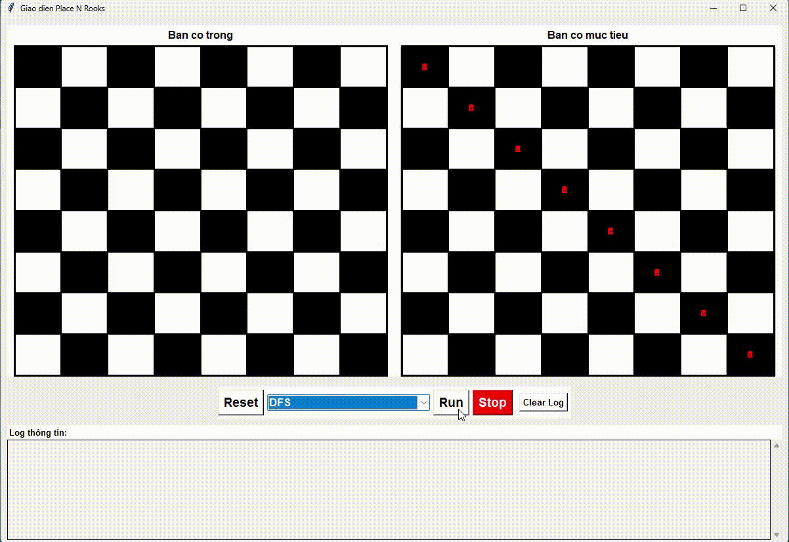

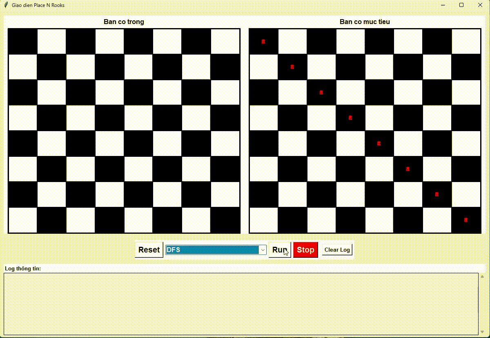

**-- UCS (Uniform-Cost Search)--**
def ucsSolution(self):
Sử dụng hàng đợi ưu tiên (Priority Queue) để luôn mở rộng trạng thái có chi phí đường đi (g(n)) thấp nhất.
+ Chi phí được tính bằng hàm self.cost(state): Tổng số lượng trạng thái còn thiếu (nếu chưa đủ N=8 quân) cộng với khoảng cách Manhattan.
+ Áp dụng cơ chế thay thế: Nếu tìm thấy một đường đi đến trạng thái đã thăm với chi phí tốt hơn, trạng thái cũ sẽ được cập nhật hoặc thay thế trong hàng đợi.

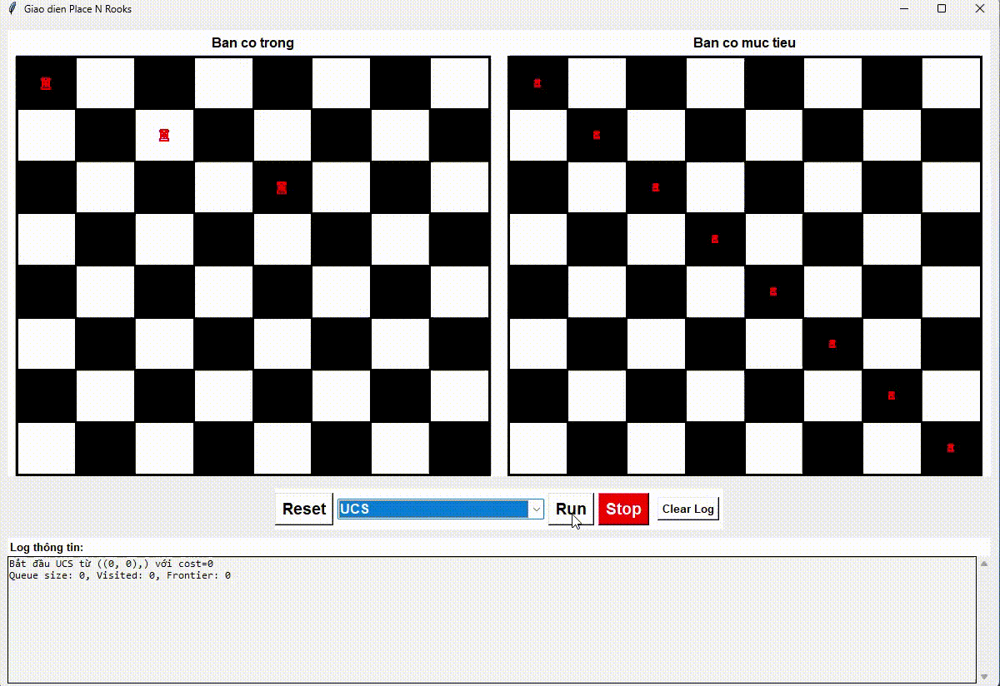

**--DLS (Depth-Limited Search) và IDS (Iterative Deepening Search)--**
def dlsSolution(self, limit=8):
def recursiveDLS(self, state, visited, limit, depth):
def idsSolution(self, maxDepth = 20):
DLS: Là hàm tìm kiếm đệ quy giới hạn độ sâu. Hàm recursiveDLS thực hiện tìm kiếm đệ quy và hoạt động như DFS. Nếu đạt đến limit mà không tìm thấy goal state, nó trả về "cutoff".
IDS: Gọi lặp lại dlsSolution với giới hạn độ sâu tăng dần từ 0 đến maxDepth. Kết hợp tính toàn vẹn của BFS (vì tìm kiếm theo độ sâu tăng dần) và hiệu quả bộ nhớ của DFS.

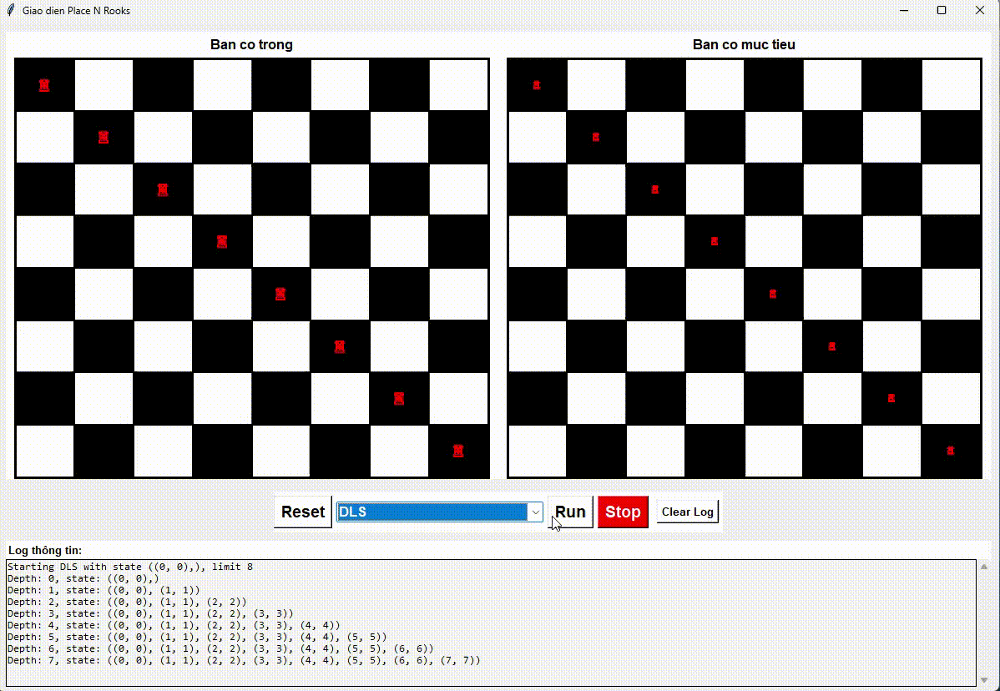

**--- Informed Search-----------------------------------------------------------------------------------------
--Greedy Search--**
def greedySolution(self):
Sử dụng hàng đợi ưu tiên (Priority Queue) để mở rộng trạng thái có chi phí heuristic (h(n)) thấp nhất. Heuristic h(n) được tính bằng hàm costMahattan(state): Tổng khoảng cách Manhattan giữa tất cả quân xe hiện tại và tất cả quân xe mục tiêu. Khoảng cách Manhattan giữa hai vị trí (r1,c1) và (r2,c2) là ∣r1−r2∣+∣c1−c2∣.

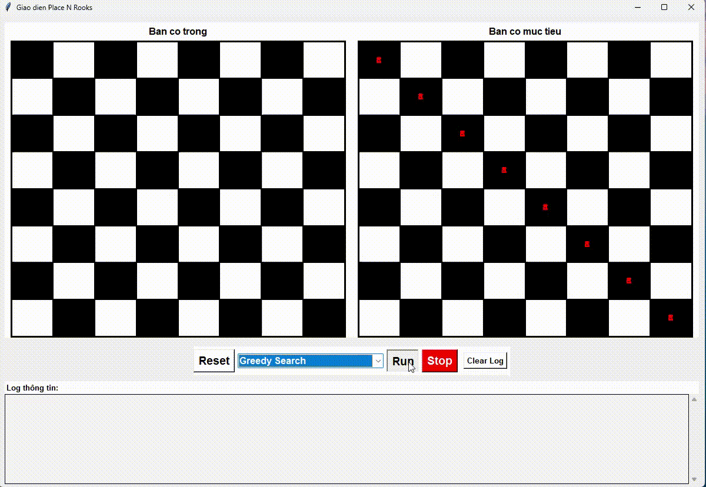

**-- A* Search--**
def aStarSolution(self):
Sử dụng hàng đợi ưu tiên (Priority Queue) để mở rộng trạng thái có tổng chi phí f(n)=g(n)+h(n) thấp nhất.
+ Chi phí đường đi (g(n)) được tính bằng cost(state) (chi phí để đạt đến trạng thái hiện tại).
+ Chi phí heuristic (h(n)) được tính bằng costMahattan(state) (ước lượng chi phí từ trạng thái hiện tại đến mục tiêu).

**---Local Search (Tìm kiếm cục bộ)----------------------------------------------------------------------
-- Hill Climbing--**
def hillClimbing(self):
def getBestRookSuccessor(self, state):
Bắt đầu từ một trạng thái ngẫu nhiên, gọi hàm getBestRookSuccessor để tìm trạng thái lân cận tốt nhất. Hàm này di chuyển một quân trong trạng thái hiện tại để tạo thành trạng thái mới và đánh giá bằng hàm heuristic costChebyshev(state). Sau đó chọn trạng thái có chi phí thấp nhất.
+ Tổng khoảng cách Chebyshev đến mục tiêu: Khoảng cách Chebyshev giữa (r1,c1) và (r2,c2) là max(∣r1−r2∣,∣c1−c2∣).
Kiểm tra trạng thái mới có tốt hơn trạng thái hiện tại hay không (có chi phí thấp hơn). Nếu có thì chọn trạng thái đó rồi tiếp tục tìm lận cận tót nhất. Hill Climbing dừng lại khi đạt goal state hoặc không tìm được trạng thái tốt hơn (đạt local maximum).

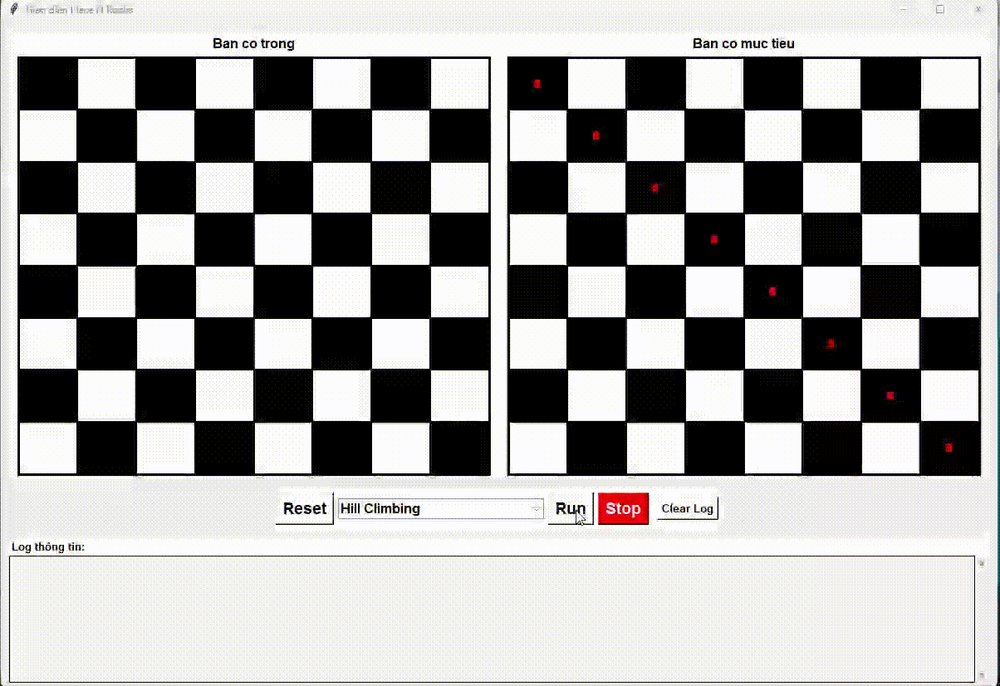

**-- Simulated Annealing --**
def simulatedAnnealing(self):
Giống Hill Climbing, nhưng cho phép di chuyển đến trạng thái tệ hơn (chi phí cao hơn) với một xác suất e−ΔE/T.
+ ΔE: Sự khác biệt chi phí giữa trạng thái tiếp theo và trạng thái hiện tại.
+ T: Nhiệt độ, giảm dần theo thời gian (hàm schedule(t)).
Sử dụng getRandomRookSuccessor để sinh ra trạng thái lân cận ngẫu nhiên bằng cách di chuyển 1 quân ngẫu nhiên tới 1 vị trí trống ngẫu nhiên.
Chi phí được đánh giá dựa trên costChebyshev(state) và countRookConflicts(state) (số cặp quân xe tấn công nhau).

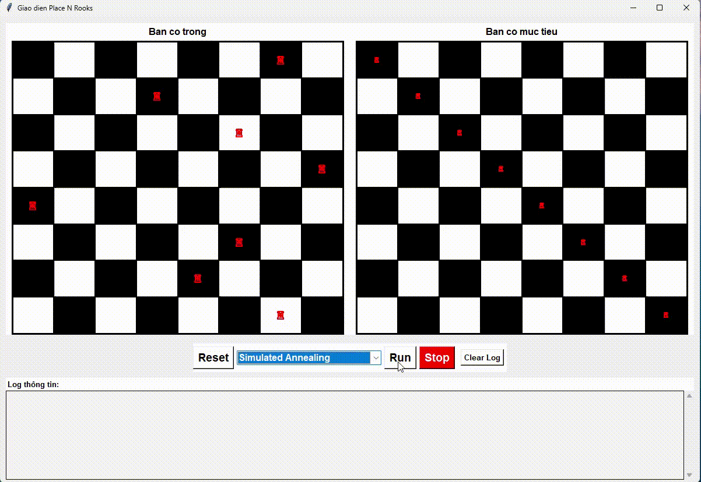

**-- Beam Search--**
def beamSearch(self):
Duyệt qua các cấp độ trạng thái như BFS, nhưng ở mỗi cấp độ chỉ giữ lại k trạng thái tốt nhất (beam width) để mở rộng ở cấp độ tiếp theo. Sử dụng heuristic costChebyshev(x) để đánh giá và chọn k trạng thái tốt nhất.

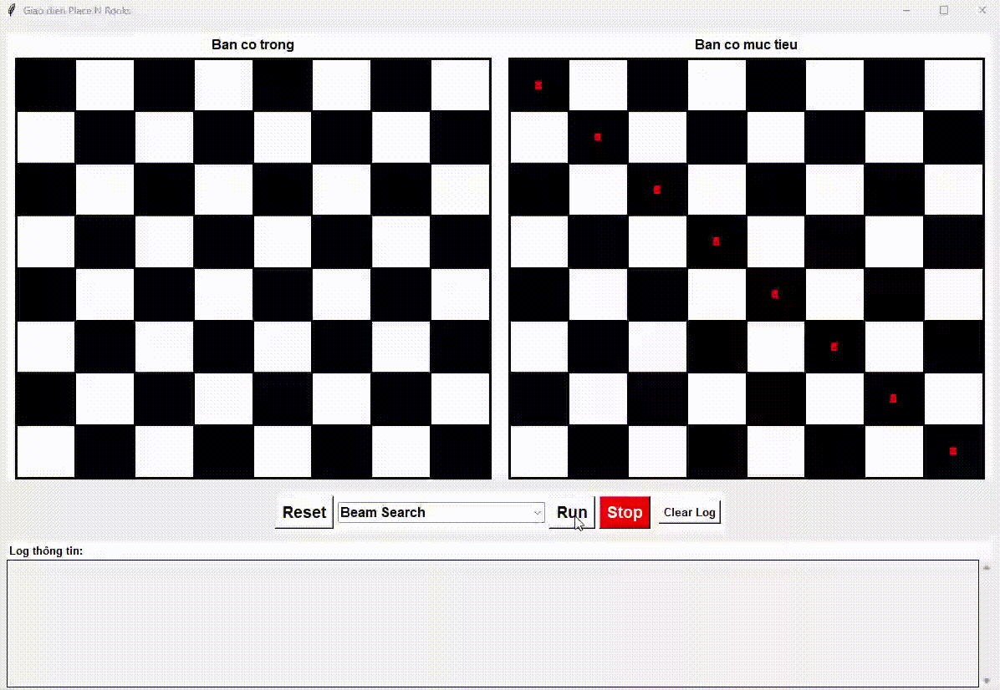

**--Genetic Algorithm--**
def geneticAlgorithm(self, maxGenerations=100, 
populationSize=10, mutationRate=0.2):
Tham số: maxGenerations – số thế hệ tối đa, populationSize – kích thước quần thể, mutationRate – tỉ lệ đột biến. 
Là thuật toán tìm kiếm tối ưu hóa, lấy cảm hứng từ quá trình chọn lọc tự nhiên, mô phỏng sự tiến hoá.
Quần thể (Population): Khởi tạo tập quần thể ban đầu ngẫu nhiên.
Fitness: Tính fitness của của các cá thể trong quần thể. Tính bằng fitness(state) - tổng của self.countRookConflicts và costChebyshev đến mục tiêu (chi phí càng thấp, fitness càng tốt).
Chọn lọc: Chọn 2 cá thể tốt nhất (chi phí thấp nhất) làm cha mẹ.
Lai ghép (Crossover): Kết hợp gen (vị trí quân xe) của cha mẹ để tạo ra con cái. Dùng hàm crossover(p1,p2) để lai ghép với p1,p2 là các list các cặp (row,col). Ta lấy 4 vị trí đầu trong list p1 kết hợp với 4 vị trí cuối của p2, 4 vị trí đầu của p2 kết hợp với 4 vị trí cuối của p1. Hàm này trả về hai con. 
Đột biến (Mutation): Thay đổi ngẫu nhiên vị trí cột của 2 hàng trong cá thể con để tăng tính đa dạng. Với tỉ lệ ngẫu nhiên, ta đột biến các con thu được sau lai ghép bằng cách gọi hàm mutate(state). Hàm này hoán đổi cột giữa hai hàng để tạo ra cá thể mới.
Duy trì kích thước quần thể cố định bằng cách chỉ giữ lại các cá thể tốt nhất sau mỗi thế hệ (có cả các cá thể chưa chọn). Lặp lại quá trình chọn lọc cho đến khi đạt tới cá thể mục tiêu hoặc đạt giới hạn số thế hệ tối đa.

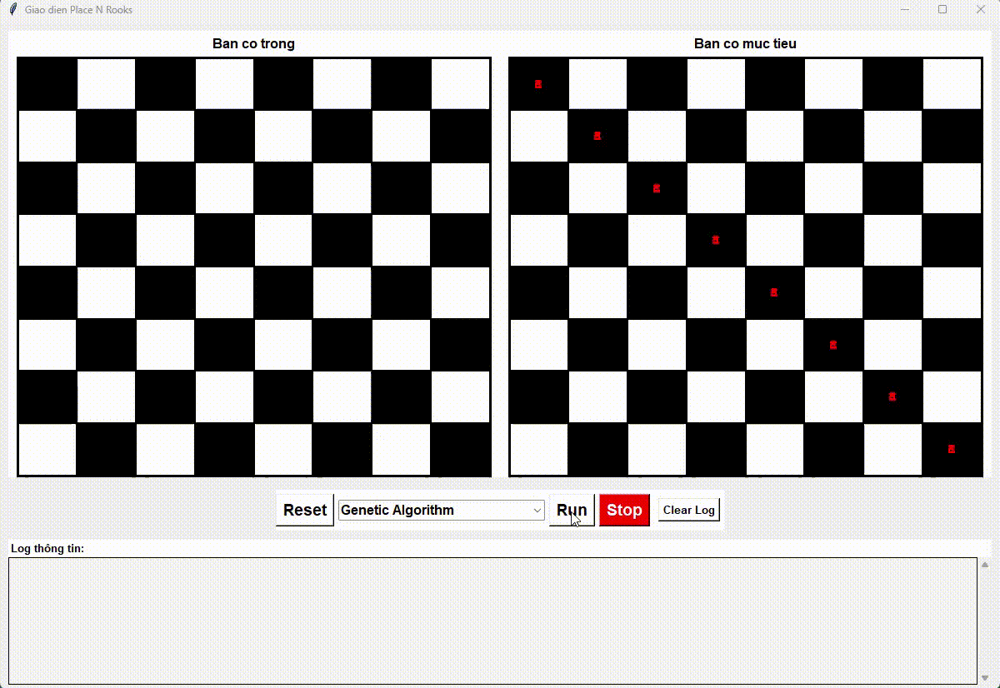

**--Advanced Search-----------------------------------------------------------------------------------------
--Recursive AND-OR Tree Search (DFS)--**
def andOrSearchSolution_DFS(self):
def orSearch(self, state, path):
def andSearch(self, states, path):
Giải quyết bài toán Non-Deterministic (không xác định) hoặc Conditional Planning (lập kế hoạch có điều kiện).
	+ OR-Search (Hàm orSearch(state, path)): Đại diện cho điểm lựa chọn hành động. Hàm này thành công khi ít nhất một hành động thành công. Nếu có chu trình thì trả về failure.  Gọi hàm getAction(state) để lấy tất cả hành động có thể thực hiện từ state hiện tại. Gọi hàm getResults(state, action) để thực hiện hành động và lấy các state kết quả (1 action  1 outcome). Hoặc trong trường hợp non-deterministic, gọi hàm getNonDeterministicResults(state, action) để 1 action có nhiều outcomes. Gọi hàm andSearch để tiếp tục tìm kết quả theo cây And – Or.
    + AND-Search (Hàm andSearch): Đại diện cho các kết quả có thể của một hành động (Outcome). Cần đảm bảo tất cả các outcome đều dẫn đến một kế hoạch thành công.
Sử dụng DFS để duyệt cây AND-OR.
Dùng isGoalState(state) kiểm tra 8 quân xe khớp với currentPositions.

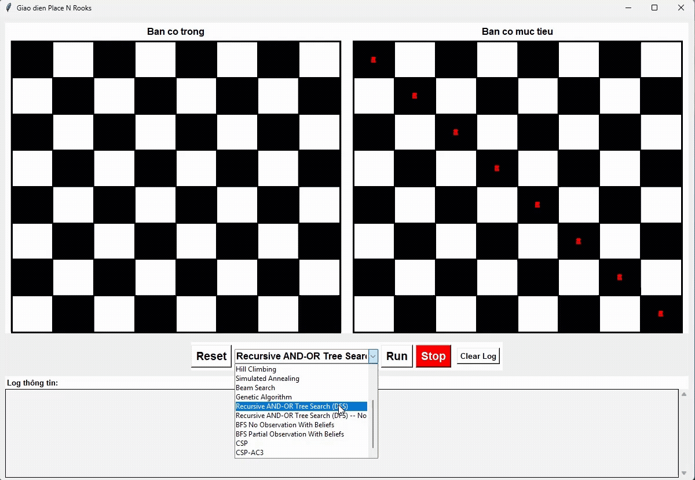

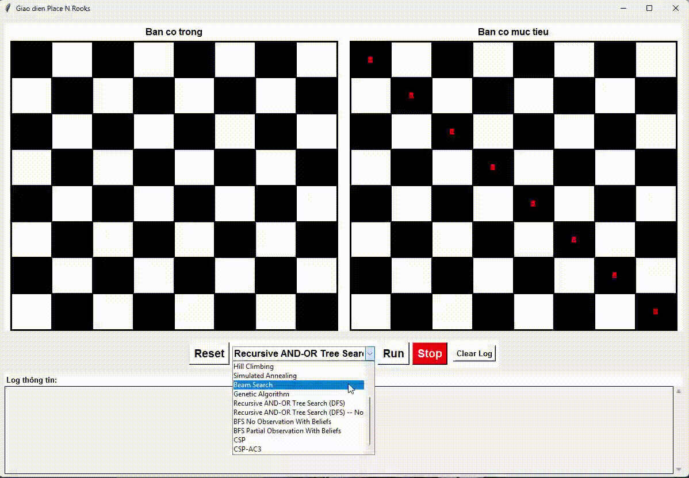

**-- BFS No Observation With Beliefs--**
def bfsNoObservationWithBeliefs(self):
Tìm kiếm trong môi trường không nhìn thấy hay không gian niềm tin (Belief Space), là nơi mà trạng thái hiện tại là một tập hợp các trạng thái thực tế có thể xảy ra gọi là trạng thái niềm tin (Belief State). Hàm này hoạt động như BFS: ta lấy 1 state ra khỏi queue, kiểm tra goal state, sinh state mới từ state hiện tại bằng cách thực hiện hành động  rồi đưa vào queue. Nhưng ở đây thay vì state thì nó là belief state, hành động là tập hành động có thể thực hiện. Gọi hàm getAllPossibleActions(currentPieces) để lấy tập hành động có thể thực hiện. Khi thực hiện một hành động, do không có quan sát được, Belief state mới được sinh ra bằng cách áp dụng hành động đó cho tất cả các state trong belief (bằng cách gọi hàm executeActionBlindly(current_pieces, action) cho từng state trong belief). Hàm này đạt goal khi tất cả các state trong belief state đều đạt goal state.

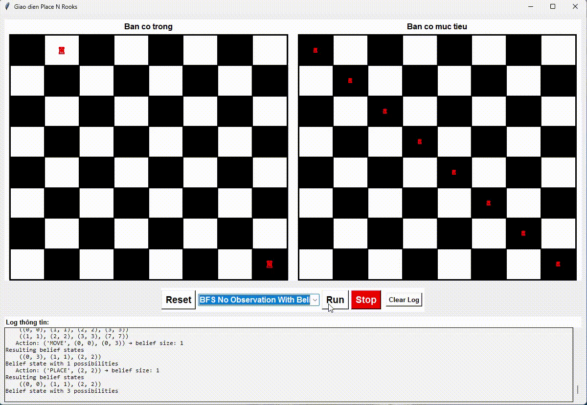

**--BFS Partial Observation With Beliefs--**
def bfsPartialObservationWithBeliefs(self):
Giống với BFS No Observation With Beliefs, nhưng quan sát được một phần của goal state. (ví dụ: 1 vị trí quân xe mục tiêu). Nên trong tập hành động, không được thay đổi phần quan sát được. 

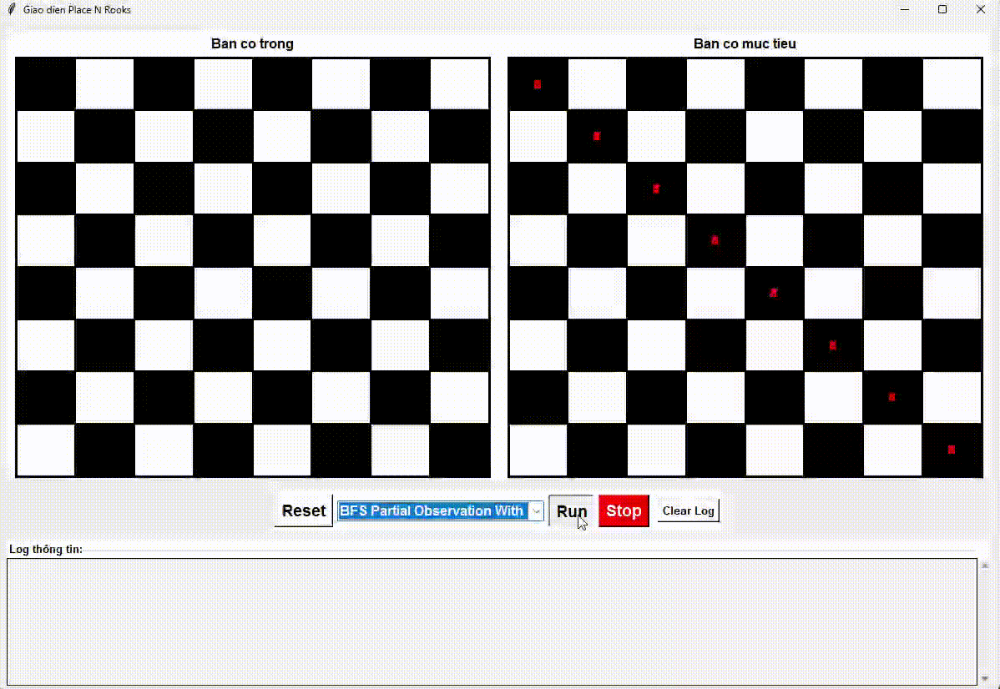

**---Constraint Satisfaction Problems (CSP)-----------------------------------------------------------
--CSP (Backtracking Search với Forward Checking)--**
def cspSolution(self):
Giải quyết bài toán bằng cách gán giá trị cho từng biến (quân xe).
Sử dụng Backtracking cơ bản kết hợp với Forward Checking (hàm forwardCheck) để loại bỏ các giá trị không khả thi khỏi domain của các biến chưa được gán ngay sau khi một biến được gán.
Sử dụng chọn ngẫu nhiên biến và giá trị.

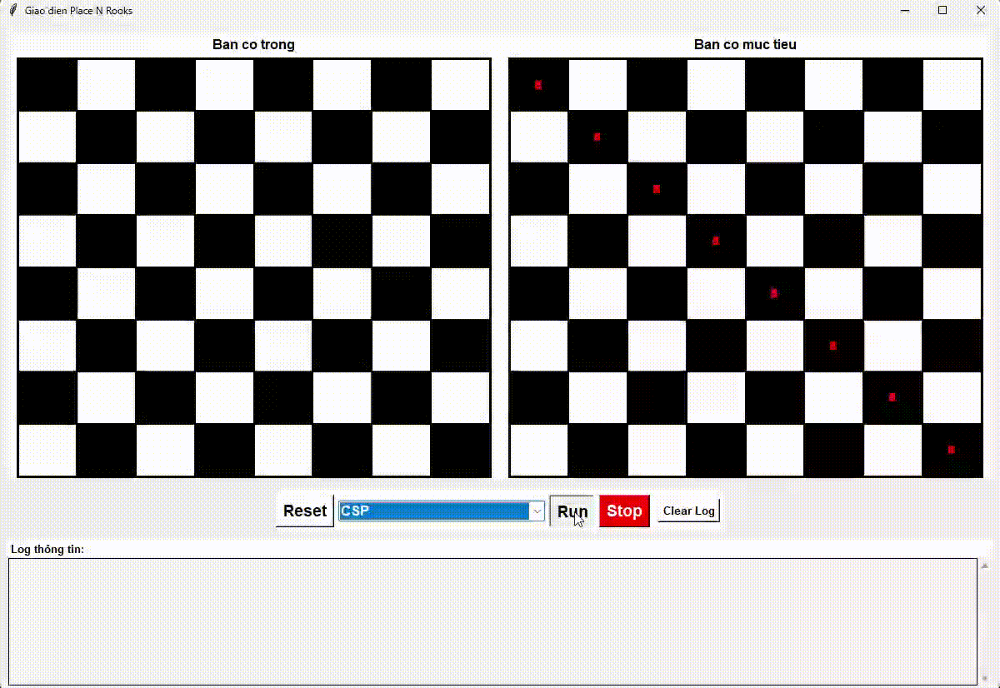

**--CSP-AC3 (Backtracking Search với AC-3)--**
def cspSolutionAC3(self):
Giải quyết bài toán bằng cách sử dụng thuật toán Arc Consistency 3 (AC-3) để thu hẹp domain của các biến, sau đó dùng Backtracking.
+ AC-3: Duy trì tính nhất quán cung (Arc Consistency) giữa các cặp biến. Nó loại bỏ các giá trị không nhất quán khỏi domain.
+ Backtracking: Sau khi AC-3 thu hẹp domain, sử dụng Backtracking để tìm lời giải chính xác. 

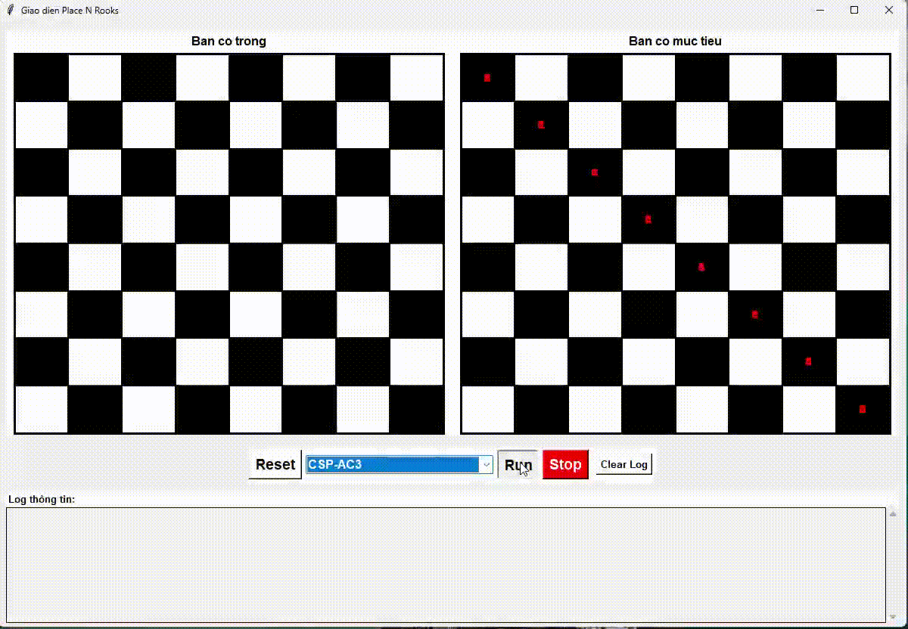

